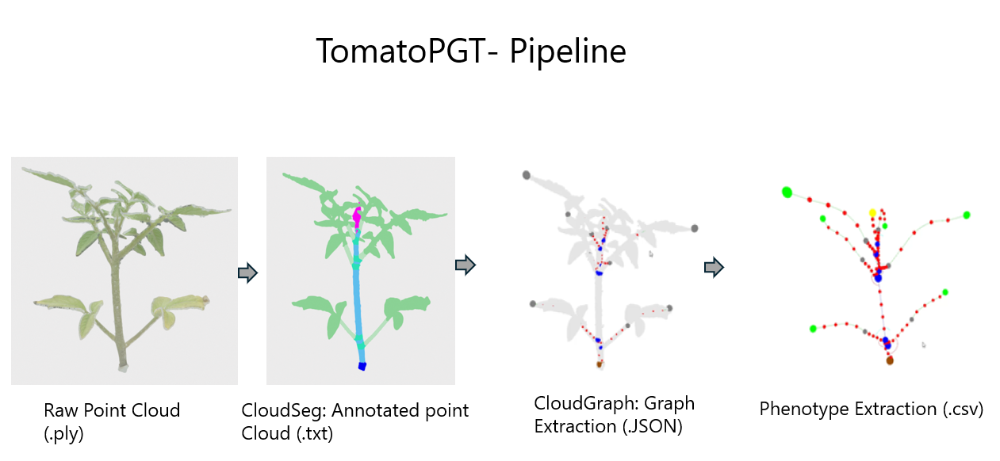
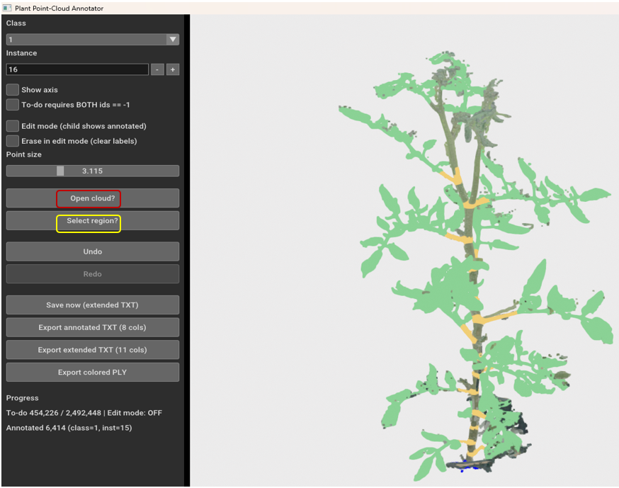
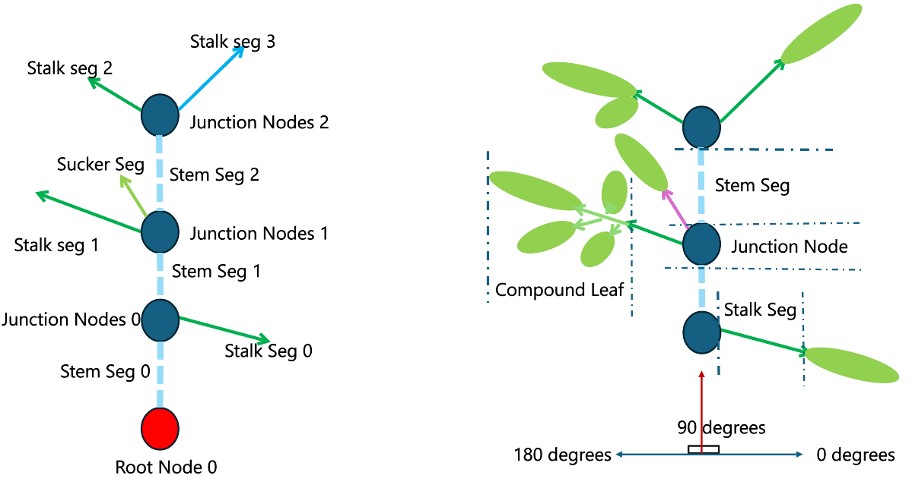
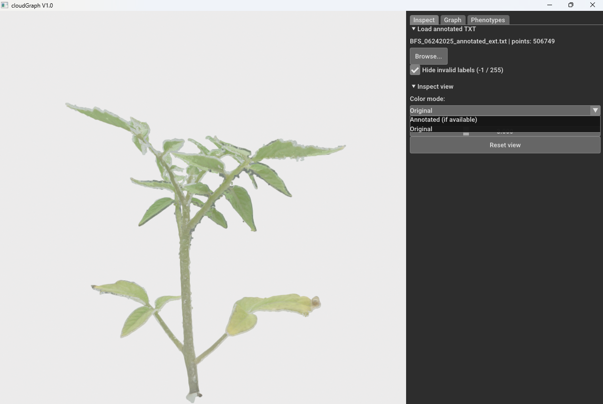
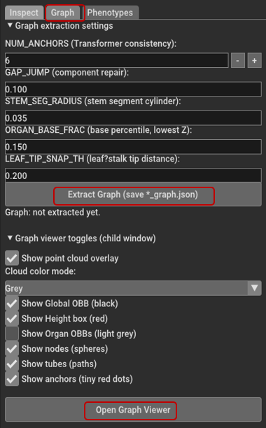
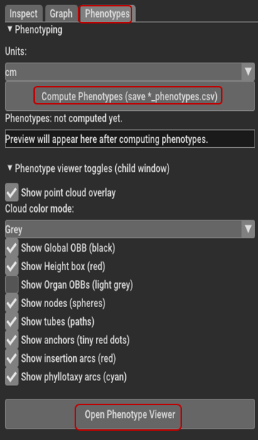
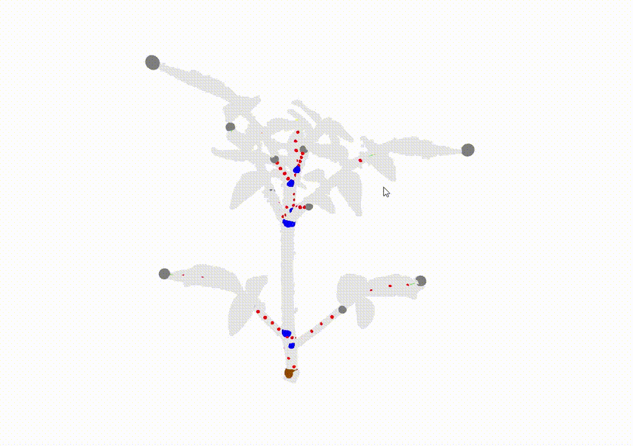
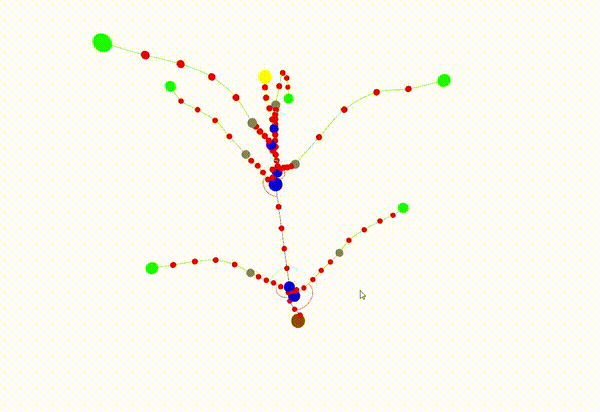

# 🌿 TomatoPGT Tools — CloudSeg + CloudGraph

###     Organ-Level Digital Twin Modeling from 3D Tomato Plant Point Clouds
<p align="center">  </p>

## 🔬 Overview

TomatoPGT Tools provide a reproducible pipeline for transforming raw 3D tomato plant point clouds into:

🌱 Structurally annotated organ-level data

🌳 Semantic plant graphs

📊 Quantitative phenotypic traits


These tools were developed to support the TomatoPGT Data in Brief publication and enable reproducible structural annotation, semantic graph extraction, and phenotype computation.


## 📦 Tools
| Tool                        | Input            | Output             | Purpose                     |
| --------------------------- | ---------------- | ------------------ | --------------------------- |
| **CloudSeg**                | `.ply`           | Annotated `.txt`   | Manual structural labeling  |
| **CloudGraph (Graph)**      | Annotated `.txt` | `*_graph.json`     | Semantic graph construction |
| **CloudGraph (Phenotypes)** | `*_graph.json`   | `*_phenotypes.csv` | Trait computation           |


## ⚡️ Quick Start

### ⚙️ Installation
System Requirements

Windows 11 (64-bit)
Python 3.11 [1]
Open3D [2]
NumPy [3]
SciPy [4] 
scikit-learn [5]

1️⃣ Create Environment

````sh

conda create -n TomatoPGT python=3.11 -y
conda activate TomatoPGT
python -m pip install -U pip
pip install open3d==0.19.0 numpy scipy pandas scikit-learn
````

2️⃣ Install Tools

````sh
pip install wheels/cloudseg-1.0.0-cp311-cp311-win_amd64.whl
pip install wheels/cloudgraph-1.0.0-cp311-cp311-win_amd64.whl
````

3️⃣ Run

````python
python -m cloudseg.runner
python -m cloudgraph.runner
````

## 📂 Sample Dataset

A minimal dataset is provided in `sample_dataset/` to test the full pipeline:

1. Open `Data_cSeg_raw/BFS_R_06242025.ply` in CloudSeg
2. Annotate with CloudSeg tool and save `BFS_06242025_annotated_ext.txt`
3. Load into CloudGraph tool : `BFS_06242025_annotated_ext.txt`
4. Generate graph and phenotypes


## 🌿 CloudSeg — Structural Annotation
Input
Raw .ply point cloud only


CloudSeg will not load .txt or .json files.

Output
Annotated .txt file


GUI Overview
<p align="center">  </p>

CloudSeg implements a Parent–Child Open3D workflow:

Parent → Full plant view

Child → Region selection and cropping

## 🧭 Annotation Workflow

| **Step** | **Description** | **Controls / Notes** |
|---------|------------------|-----------------------|
| **Step 1 — Load Point Cloud** | Click **Open Cloud…** and load a `.ply` file. | — |
| **Step 2 — Adjust View** | Manipulate the 3D view using Open3D controls. | • Mouse wheel → Zoom<br>• Drag → Rotate<br>• Pan → Reposition<br><br>⚠ View may require manual adjustment after redraw. |
| **Step 3 — Set Class + Instance** | Choose the structural class and assign the correct instance ID *before* making selections. | ⚠ Essential for correct graph reconstruction. |
| **Step 4 — Select Region** | Click **Select Region…** and use tools inside the selection window. | • **K** → Activate selection<br>• **Ctrl + Left Click** → Polygon selection<br>• Drag → Rectangle selection<br>• **C** → Crop<br>• **Q** → Confirm |
| **Step 5 — Verify** | The selected region appears in its palette color. | If incorrect:<br>• Undo<br>• Redo |


Structural Schema for Annotation workflow:
<p align="center">  </p>

## Simplified Annotation Schema

| **Class name used**     | **Class Description**                           | **Common Annotation Errors**        |
|-------------------------|-------------------------------------------------|-------------------------------------|
| **Root-Node**           | Origin of the plant                             | Broken stem chain                   |
| **Junction-Nodes**      | Fork on the Stem segment                        | Leaf and stalk mixed                |
| **mainStem-Seg**        | Stem segments / Internode                       | Duplicate instance IDs              |
| **Compound Leaf-Node**  | Leaflets + Rachis                               | Missing Root-Node                   |
| **Stalk-Seg**           | Petiole (Junction node to Compound Leaf)        | —                                   |
| **Sucker-Seg**          | Sucker / Branch / Axil                          | —                                   |

---

## CloudSeg — Detailed Usage Guide (Open3D-based Annotation GUI)

CloudSeg is a **manual point-cloud annotation GUI** built directly on top of **Open3D**. Its purpose is to label complex tomato plant point clouds quickly and consistently using a **simplified structural annotation schema** (nodes + edges) that is later consumed by **CloudGraph** for graph extraction and phenotype computation.

Because CloudSeg relies on Open3D’s visualization and selection pipeline (camera controls, selection modes, cropping keys, etc.), several UI behaviors are **inherently Open3D-dependent**. CloudSeg is best understood as a robust annotation workflow around Open3D’s native selection tools rather than a fully custom 3D editor.

---

### Input Requirements

#### Supported input format

* **Raw point cloud only:** `.ply`

#### Notes

* If the `.ply` contains colors, CloudSeg uses them for the unannotated view.
* If no colors exist, CloudSeg assigns a default gray color.

---

### Structural Annotation Schema (TomatoPGT Simplified Topology)

CloudSeg is designed for **graph-style annotation**, not per-leaflet segmentation. To obtain a consistent downstream graph in CloudGraph, annotations must follow the simplified structural schema (see Fig. 3 in the manuscript).

#### Core representation

* **Root-Node**: basal attachment point / plant base
* **Junction-Nodes**: nodes along the main stem (between internodes)
* **mainStem-Seg**: edges connecting consecutive junction nodes
* **Compound Leaf-Node**: entire compound leaf as one unit (leaflets + rachis combined)
* **Stalk-Seg**: petiole/stalk from junction to compound leaf
* **Sucker-Seg**: lateral vegetative shoot emerging from a junction
* Optional node types: **Cotyledon**, **Flower cluster**, **Fruit cluster**, **Primordium**

#### Why this matters

If the annotation breaks stem continuity, mixes attachment organs, or omits major structures, CloudGraph may:

* produce incomplete/incorrect graphs,
* connect organs incorrectly,
* compute unreliable phenotypes.

---

## How the GUI Works 

CloudSeg uses two windows:

### Parent window (main GUI)

* Displays the **full point cloud**
* **Annotated points** are shown using the predefined **palette color** for their class
* **Unannotated points** remain in original RGB

### Child window (selection/cropping window)

* Opens when you click **Select region…**
* Shows only a subset of points:

  * **Normal mode:** only unannotated points
  * **Edit mode:** only **annotated** points (for correction / erase workflows)
* Used for precise selection and cropping using **Open3D VisualizerWithEditing**

> The child window is launched internally by CloudSeg.

---

## Step-by-Step Annotation Instructions

### 1) Load the raw `.ply`

1. Launch CloudSeg
2. Click **Open cloud…**
3. Select the input `.ply`

---

### 2) Adjust the camera view (Open3D behavior)

Use standard Open3D mouse interactions:

* **Mouse wheel:** zoom in/out
* **Rotate / pan:** reposition and inspect the plant structure

**Important note:**
Because this tool is Open3D-driven and camera persistence was not fully stabilized in this build, you may need to **re-adjust view** (zoom/scroll) after major redraws. This does not affect correctness, only usability.

---

### 3) Choose your label: Class + Instance ID

Before selection, set:

#### Class

Select the correct class from the dropdown (Root-Node, Junction-Node, mainStem-Seg, etc.).

#### Instance ID

Instance ID distinguishes repeated structures of the same class (e.g., multiple leaves, multiple junctions).

**Workflow rule:**
Always confirm **Class + Instance** before pressing **Select region…**, because the next cropped selection will be assigned exactly those values.

---

### 4) Open the child selection window

Click **Select region…** to open the child window.

The child window typically shows a reduced set of points, which makes it much easier to label dense plant regions without confusion.

---

### 5) Lock selection mode and select the region of interest

Inside the child window:

1. Press **`K`** to lock / activate selection mode (required before cropping)
2. Select your region using one of these Open3D modes:

#### Free polygon selection

* Hold **Ctrl** and use **left-click** to draw a polygon around the region

#### Rectangle selection

* **Left click + drag** to draw a rectangle around the region

(Exact interaction can vary slightly across OS and Open3D versions, but the core idea is polygon or rectangle selection.)

---

### 6) Crop and return to the parent view

1. Press **`C`** to crop the selected region
2. Press **`Q`** to quit the child window and return to the parent

In the parent window, the selected region should now appear colored using the predefined class palette. This is your immediate confirmation that labeling was applied.

---

### 7) Verify the result, then continue or correct

After each selection:

* Confirm that only the intended organ/segment was colored.
* If the selection was imperfect (common in occlusions/overlaps), correct it using:

  * **Undo**
  * **Redo**

---

### 8) Handling overlaps and occlusions (recommended approach)

Overlapping leaves and occluded branches are common. CloudSeg supports iterative refinement:

* Crop a rough selection first
* Run **Select region…** again and crop more precisely
* Repeat until you are satisfied

A key advantage is that the child window continues to show what remains to be labeled, reducing cognitive load during complex annotations.

---

### 9) Save / Export annotated output (TXT for CloudGraph)

CloudSeg exports annotation to **TXT**, which is used later by CloudGraph.

Common outputs include:

* **Extended TXT (11 columns)** — recommended for full downstream processing
* Annotated TXT (8 columns) — compact format

Autosave (if enabled) typically writes alongside the original `.ply` as:

* `<input_stem>_annotated_ext.txt`

---

## Advantages

* **Fast annotation using Open3D-native selection**
* **Parent–child workflow reduces visual clutter** during labeling
* **annotation** simplifies completion tracking
* **Works well for occluded/overlapping organs** via iterative cropping
* **Undo/Redo** enables repair without restarting

---

## Limitations / Known Issues

* **Camera view requires manual adjustment** at times (Open3D behavior + current camera-state handling)
* **Instance ID management is manual** and can be error-prone during Undo/Redo
* **Selection interactions depend on Open3D + OS input behavior**
* **Downstream quality depends on schema consistency** (missing junctions/attachments will degrade CloudGraph output)

---

## Common Mistakes (and how to avoid them)

### 1) Junction chain breaks (stem continuity failure)

**Symptom:** CloudGraph produces a stem graph with missing links, wrong ordering, or disconnected components.
**Cause:** Junction-Nodes and mainStem-Seg were not annotated as a continuous chain from Root-Node upward.
**Fix / Prevention:**

* Start annotation by building the stem first:

  1. Root-Node
  2. Junction-Nodes (sequential along the main stem)
  3. mainStem-Seg between consecutive junctions
* Avoid skipping junctions; if a junction is missing, CloudGraph may bridge incorrectly.

---

### 2) Leaf and stalk mixed together

**Symptom:** A compound leaf appears connected incorrectly or merged with the petiole/stalk, causing wrong leaf attachment geometry.
**Cause:** Cropping included both the leaflets/rachis region and the stalk region under one class.
**Fix / Prevention:**

* Label **Stalk-Seg** first (junction → petiole) and **Compound Leaf-Node** as a separate crop.
* In overlap zones, use iterative cropping:

  * crop rough → return → crop remaining points again to separate structures.

---

### 3) Instance ID duplication or “drift”

**Symptom:** Multiple leaves/junctions share the same Instance ID, or numbering becomes inconsistent.
**Cause:** Instance IDs are manually controlled; Undo/Redo does not automatically “rewind” your instance counter.
**Fix / Prevention:**

* Maintain a simple habit:

  * Before each selection, verify the instance box matches what you intend to label.
* After Undo:

  * manually decrement instance ID if you are redoing the same structural element.

---

### 4) Wrong class selected in parent window before cropping

**Symptom:** Selected region is colored incorrectly (wrong palette), forcing repeated undo/redo.
**Cause:** The parent window class dropdown was not updated before opening the child window.
**Fix / Prevention:**

* Treat the parent dropdown as “active label state.”
* Always set **Class + Instance** *before* pressing **Select region…**

---

### 5) Over-cropping in dense regions (occlusion zones)

**Symptom:** A selection unintentionally captures a neighboring organ.
**Cause:** In occluded regions, rectangle selection or broad polygon selection can include multiple organs at once.
**Fix / Prevention:**

* Prefer polygon selection for complex zones.
* Use multiple small crops rather than one large crop.
* Rely on the “child view” to progressively isolate remaining points.

---


## 🌳 CloudGraph — Semantic Graph Extraction
Input (Annotated .txt) file from CloudSeg --> Output (*_graph.json)

⚠ Never load raw .ply.

Inspect Tab
<p align="center">  </p>

validate:

Structural annotation

Toggle Color mode: Annotated vs Orginal 

Point size


### 🌱 Graph Tab Workflow

Review parameters

Click Extract Graph

Confirm *_graph.json

|  |  |
|---|---|
|  |  |

*Left: Control tab (Graph)* | *Right: Control tab (Phenotype)*

</div>

### 🌱 CloudGraph — Phenotypes
Input
*_graph.json

Output
*_phenotypes.csv

Phenotype Tab Workflow:

Select units (default: cm)

Click Compute Phenotypes

Export *_phenotypes.csv

🎞 Graph Extraction  and Phenotype Visual Animation

<table>
  <tr>
    <td align="center">
        <h4>clodgraph Graph Extraction</h4>
        
    </td>
    <td align="center">
        <h4>clodgraph Phenotype Extraction</h4>
        
    </td>
  </tr>
</table>
``

</div>


## 📊 Computed Traits

| Category | Description |
|----------|------------|
| **Internode Lengths** | Distance between consecutive Junction-Nodes along the main stem |
| **Stem Height** | Vertical extent of the reconstructed plant graph |
| **Branching Metrics** | Structural connectivity and branching order derived from the semantic graph |
| **Leaf Insertion Angles** | Angular orientation between main stem and Compound Leaf attachment |
| **Sucker Orientation** | Direction and angle of lateral vegetative shoots |


## 🔄 Recommended Workflow

| Step | Action | Tool |
|------|--------|------|
| 1 | Annotate full plant structure | **CloudSeg** |
| 2 | Export annotated `.txt` | CloudSeg |
| 3 | Load annotated file | **CloudGraph → Inspect tab** |
| 4 | Validate annotation colors & structure | CloudGraph |
| 5 | Extract semantic graph (`*_graph.json`) | **Graph tab** |
| 6 | Validate topology in Graph Viewer | CloudGraph |
| 7 | Compute phenotypes (`*_phenotypes.csv`) | **Phenotypes tab** |


## 🧪 Troubleshooting

| Issue | Possible Cause | Recommended Fix |
|-------|----------------|----------------|
| CloudGraph freezes on load | Missing Root-Node | Ensure Root-Node is annotated in CloudSeg |
| Graph extraction fails | Broken junction chain | Verify continuous Junction-Nodes along stem |
| Incorrect attachments | Leaf and stalk mixed labels | Separate Compound Leaf and Stalk-Seg during annotation |
| Graph ambiguity | Duplicate Instance IDs | Ensure unique instance numbering |
| Slow processing / instability | Large unannotated (-1) regions | Complete annotat
Uninstall
pip uninstall cloudseg cloudgraph

📖 Citation
@article{TomatoPGT2026,
  title   = {TomatoPGT: A 3D point cloud dataset of tomato plants for segmentation and plant-trait extraction},
  author  = {Nethala, Prasad et al.},
  journal = {Data in Brief},
  year    = {2026}
}

📜 License

MIT License
See LICENSE file.

## References

[1] Python Software Foundation, “Python Language Reference (Version 3.11.x).” Available: https://www.python.org

[2] Q.-Y. Zhou, J. Park, and V. Koltun, “Open3D: A Modern Library for 3D Data Processing,” *arXiv:1801.09847*, 2018.

[3] C. R. Harris *et al*., “Array programming with NumPy,” *Nature*, vol. 585, pp. 357–362, 2020.

[4] P. Virtanen *et al*., “SciPy 1.0: Fundamental algorithms for scientific computing in Python,” *Nature Methods*, vol. 17, pp. 261–272, 2020.

[5] F. Pedregosa *et al*., “Scikit-learn: Machine Learning in Python,” *Journal of Machine Learning Research*, vol. 12, pp. 2825–2830, 2011.
