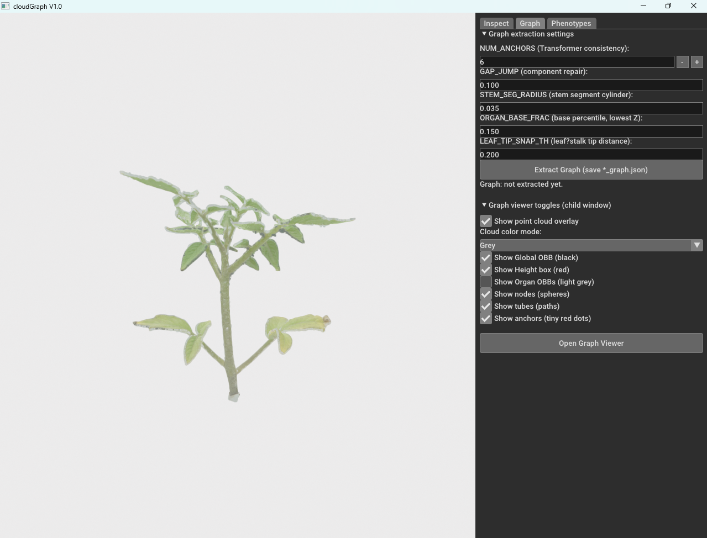

TomatoPGT Tools (Binary Release)

CloudSeg + CloudGraph
Organ-Level Digital Twin Modeling from 3D Tomato Plant Point Clouds

Overview

TomatoPGT provides two Windows GUI tools for constructing organ-level digital twin representations of tomato plants from 3D point clouds.

These tools were developed to support the TomatoPGT Data in Brief publication and enable reproducible structural annotation, semantic graph extraction, and phenotype computation.

Tool	Purpose	Output
CloudSeg	Manual structural annotation of raw .ply point clouds	Annotated .txt
CloudGraph	Semantic graph extraction + phenotype computation	*_graph.json, *_phenotypes.csv
Digital Twin Pipeline

  

Raw Point Cloud → Structural Annotation → Semantic Graph → Phenotypes → Digital Twin

Installation
System Requirements

Windows 10 / 11 (64-bit)

Python 3.11 (64-bit CPython)

Open3D 0.19.0

1. Create Environment
conda create -n TomatoPGT python=3.11 -y
conda activate TomatoPGT
python -m pip install -U pip
pip install open3d==0.19.0 numpy scipy pandas scikit-learn

2. Install Tools
pip install wheels/cloudseg-1.0.0-cp311-cp311-win_amd64.whl
pip install wheels/cloudgraph-1.0.0-cp311-cp311-win_amd64.whl

3. Run Applications
python -m cloudseg.runner
python -m cloudgraph.runner

CloudSeg — Structural Annotation Tool
Input

Raw .ply point cloud only

GUI Overview

  

CloudSeg implements a Parent–Child Open3D workflow:

Parent Window → full point cloud

Child Window → region selection and cropping

Annotation Workflow
Step 1 — Load Point Cloud

Click Open Cloud… and load a .ply file.

Step 2 — Adjust View

Open3D Controls:

Mouse wheel → Zoom

Drag → Rotate

Pan → Reposition

Note: View may require manual adjustment after redraw.

Step 3 — Set Class + Instance

Before selecting:

Choose structural class

Set correct instance ID

This is critical for correct graph reconstruction.

Step 4 — Select Region

Click Select Region…

Inside child window:

Press K → Activate selection

Ctrl + Left Click → Polygon selection

Drag → Rectangle selection

Press C → Crop

Press Q → Confirm

Step 5 — Verify

Selected region appears in palette color.

If incorrect:

Undo

Redo

Structural Schema

  

Simplified topology:

Root-Node

Junction-Nodes

mainStem-Seg

Compound Leaf-Node

Stalk-Seg

Sucker-Seg

Common Annotation Errors

Broken stem chain

Leaf and stalk mixed

Duplicate instance IDs

Missing Root-Node

These will cause graph extraction failure.

CloudGraph — Graph Extraction & Phenotypes
Input Requirement

Must load:

Annotated .txt exported from CloudSeg

Never load raw .ply.

Tab 1 — Inspect

  

Used to:

Validate annotation

Switch color mode

Adjust point size

Reset camera

Tab 2 — Graph Extraction

  

Workflow:

Review parameters

Click Extract Graph

Confirm *_graph.json saved

Open Graph Viewer

Graph Extraction Animation

  

Tab 3 — Phenotypes

  

Workflow:

Select units (default: cm)

Click Compute Phenotypes

Export *_phenotypes.csv

Phenotype Visualization Animation

  

Computed traits include:

Internode lengths

Stem height

Branching metrics

Leaf insertion angles

Sucker orientation

Recommended Workflow

Annotate plant in CloudSeg

Export annotated .txt

Load into CloudGraph

Inspect

Extract graph

Validate topology

Compute phenotypes

Troubleshooting

If CloudGraph freezes:

Check for missing Root-Node

Ensure continuous junction chain

Verify instance IDs

Minimize large -1 label regions

Uninstall
pip uninstall cloudseg cloudgraph

Citation
@article{TomatoPGT2026,
  title   = {TomatoPGT: A 3D point cloud dataset of tomato plants for segmentation and plant-trait extraction},
  author  = {Nethala, Prasad et al.},
  journal = {Data in Brief},
  year    = {2026}
}

License

MIT License
See LICENSE file for details.